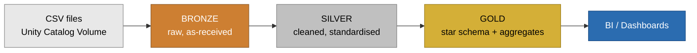
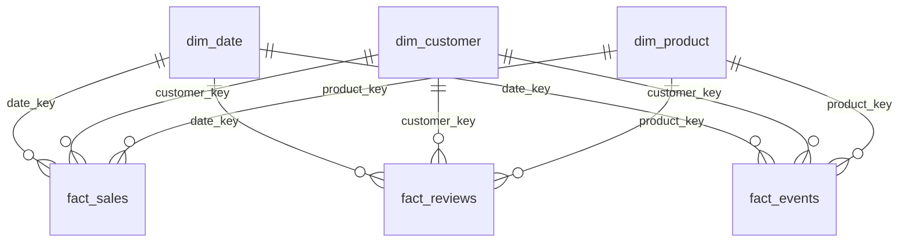

# E-Commerce Medallion Architecture — Databricks Project


An end-to-end **Bronze → Silver → Gold** data pipeline built on Databricks with Unity Catalog and Delta Lake, using a realistic e-commerce dataset. Raw CSVs land in a Volume, get cleaned layer by layer, and end up as a **star schema** ready for BI.

Built as a teaching project — every notebook is commented step by step, so you can read it before you run it.

---

## Table of contents

- [Architecture](#architecture)
- [What you will learn](#what-you-will-learn)
- [Repository structure](#repository-structure)
- [Prerequisites](#prerequisites)
- [Setup](#setup)
- [Run order](#run-order)
- [The three layers](#the-three-layers)
- [Gold star schema](#gold-star-schema)
- [Troubleshooting](#troubleshooting)
- [License](#license)

---

## Architecture



| Layer | Rule | Tables |
|---|---|---|
| **Bronze** | Load as-is. No cleaning. | 6 raw tables |
| **Silver** | Clean the **values**, never the **structure**. Same columns as bronze. | 6 cleaned tables |
| **Gold** | Reshape into a star schema and add business columns. | 3 dims + 3 facts + 1 aggregate |

---

## What you will learn

- How the medallion architecture actually works, layer by layer
- Unity Catalog basics — catalogs, schemas, Volumes, table comments
- Reading CSVs from a Volume and writing Delta tables with PySpark
- Parameterising notebooks with `dbutils.widgets` instead of hardcoding paths
- Data cleaning patterns: trimming, casing, deduplication, null handling, type casting
- Building a star schema — surrogate keys, dimensions, facts
- Derived business columns: `price_band`, `sentiment`, `signup_year`, `is_completed`, `is_purchase`
- Validation checks at the end of every layer

---

## Repository structure

```
ecommerce-medallion-databricks/
├── notebooks/
│   ├── 01_ddl_bronze.sql                  # Create catalog, bronze schema + 6 tables
│   ├── 02_ddl_silver.sql                  # Create silver schema + 6 tables
│   ├── 03_ddl_gold.sql                    # Create gold schema + dims, facts, aggregate
│   ├── 04_transform_source_to_bronze.py   # CSV  → bronze
│   ├── 05_transform_bronze_to_silver.py   # bronze → silver
│   └── 06_transform_silver_to_gold.py     # silver → gold
├── docs/
│   └── transformation_mapping.xlsx        # Column-by-column mapping across all 3 layers
├── data/
│   └── README.md                          # Expected CSV schemas
├── .gitignore
├── LICENSE
└── README.md
```

---

## Prerequisites

- A Databricks workspace with **Unity Catalog** enabled (Free Edition / Community Edition works)
- Permission to create a catalog, or an existing catalog you can write to
- A cluster or SQL warehouse running **DBR 13.3 LTS or higher**
- The six source CSV files (see [`data/README.md`](data/README.md) for the expected columns)

---

## Setup

**1. Clone into Databricks**

In your workspace: **Workspace → Repos → Add Repo** and paste this repository's URL.

Or clone locally:

```bash
git clone https://github.com/<your-username>/ecommerce-medallion-databricks.git
cd ecommerce-medallion-databricks
```

**2. Create the source Volume**

```sql
CREATE CATALOG IF NOT EXISTS e_commerce;
CREATE SCHEMA IF NOT EXISTS e_commerce.source;
CREATE VOLUME IF NOT EXISTS e_commerce.source.dataload;
```

**3. Upload the CSVs**

Put all six CSV files into:

```
/Volumes/e_commerce/source/dataload/
```

Use **Catalog → e_commerce → source → dataload → Upload to this volume**.

**4. Attach a cluster** and you are ready to run.

---

## Run order

Run these **in order**. Each one depends on the one before it.

| # | File | Type | What it does |
|---|---|---|---|
| 1 | `01_ddl_bronze.sql` | SQL | Creates the catalog, the bronze schema and 6 empty raw tables |
| 2 | `02_ddl_silver.sql` | SQL | Creates the silver schema and 6 cleaned tables |
| 3 | `03_ddl_gold.sql` | SQL | Creates the gold schema, 3 dimensions, 3 facts, 1 aggregate |
| 4 | `04_transform_source_to_bronze.py` | Notebook | Loads the CSVs into bronze, as-is |
| 5 | `05_transform_bronze_to_silver.py` | Notebook | Cleans bronze values and writes to silver |
| 6 | `06_transform_silver_to_gold.py` | Notebook | Builds the star schema in gold |

> **Tip:** each `.py` notebook exposes widgets at the top (catalog, schema, volume path, load mode). Change them in the UI — no need to edit the code.

---

## The three layers

### Bronze — raw

Six tables land exactly as the CSVs deliver them: `users`, `products`, `orders`, `order_items`, `reviews`, `events`. Nothing is cleaned here on purpose, so you can see for yourself what messy source data looks like.

### Silver — cleaned

Same six tables, same columns. Only the **values** change — whitespace trimmed, casing standardised, duplicates dropped, bad types cast, nulls handled. Compare a bronze table with its silver twin and the cleaning rules become obvious.

### Gold — modelled

Reshaped into a star schema, with a handful of new business columns:

| Table | New column | Logic |
|---|---|---|
| `dim_customer` | `signup_year` | Year extracted from `signup_date` |
| `dim_product` | `price_band` | Low / Medium / High, based on price |
| `fact_sales` | `is_completed` | Y if order status is completed |
| `fact_reviews` | `sentiment` | Positive / Neutral / Negative, based on rating |
| `fact_events` | `is_purchase` | Y if event type is purchase |

Plus surrogate keys: `customer_key`, `product_key`, `date_key`.

---

## Gold star schema



`agg_sales_summary` sits on top as a pre-aggregated table for fast dashboard reads.

---

## Troubleshooting

| Problem | Fix |
|---|---|
| `Catalog 'e_commerce' not found` | Run `01_ddl_bronze.sql` first, or ask your admin for `CREATE CATALOG` permission |
| `Path does not exist: /Volumes/...` | The Volume is not created, or the CSVs are not uploaded. Re-check Setup step 2 and 3 |
| `AnalysisException: Table not found` | You skipped a DDL script. The order in the table above is not optional |
| Notebook widgets look empty | Re-run the configuration cell — `dbutils.widgets.removeAll()` clears them on every run |
| Bronze loads 0 rows | Check your CSV has a header row and the filename matches what the notebook expects |

---

## License

Released under the [MIT License](LICENSE) — free to use, fork and adapt for your own learning.

---

<div align="center">

**Darunz** · Darun N · Greens Technologies, Chennai

</div>
